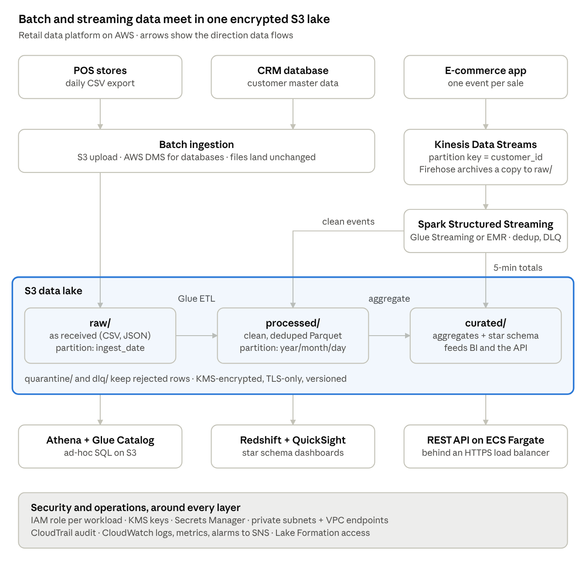

# Architecture

The platform is a layered lakehouse on S3. Batch files and real-time events land unchanged in
`raw/`; Spark (AWS Glue for batch, Glue Streaming or EMR for real time) promotes them to
`processed/` and `curated/`; Athena, Redshift and an API on ECS serve them. Everything sits inside
one KMS-encrypted, IAM-scoped, CloudWatch-monitored boundary.

## Layers

| Layer | AWS services | Role |
| --- | --- | --- |
| Sources | POS (daily CSV), e-commerce app (events), CRM database | Where data is created |
| Batch ingestion | S3 upload, AWS DMS for databases | Lands files in `raw/` exactly as received |
| Stream ingestion | Kinesis Data Streams (or MSK/Kafka); Firehose archive to `raw/` | Durable, ordered, replayable buffer |
| Storage | S3: `raw/`, `processed/`, `curated/`, `quarantine/`, `dlq/` | Source of truth; versioned, encrypted |
| Batch processing | AWS Glue (Spark); EMR for long-running or heavily tuned jobs | Validate, deduplicate, normalise, aggregate |
| Stream processing | Spark Structured Streaming on Glue Streaming / EMR | Real-time dedup, windowed aggregates, DLQ |
| Catalog & governance | Glue Data Catalog, crawlers, Lake Formation | Schemas, table/column permissions |
| Serving | Athena, Redshift (star schema), QuickSight, REST API on ECS Fargate | Analysts, dashboards, applications |
| Security & operations | IAM, KMS, Secrets Manager, CloudTrail, CloudWatch, SNS, EventBridge | Access, encryption, audit, alerting |

## Failure points and recovery

| Failure point | Detection | Recovery / retry |
| --- | --- | --- |
| Late or missing source file | "No data loaded in 26h" alarm | Watermark picks the file up on the next run |
| Bad records | DQ metrics + quarantine alarm | Rows quarantined with reasons; job fails if > 10% bad |
| Glue job crash | EventBridge job-state rule → SNS | `max_retries = 1`; watermark not advanced, rerun is safe |
| Rerun / backfill | Uniqueness check (SQL H4 on the fact = 0 rows) | Dynamic partition overwrite + dedup = idempotent |
| Kinesis throttling | Kinesis metrics | Producer retries failed records with exponential backoff |
| Stream consumer down / slow / poison message | IteratorAge alarm, DLQ volume | Restart from checkpoint; poison events to `dlq/`; stream retention allows replay |
| Schema drift | Crawler logs changes instead of applying them | Schema changes go through code review |

## Scalability

- S3 scales without limits; partition pruning means a daily run reads one day.
- Glue workers are a parameter (2 in dev, 10 × G.2X in prod); EMR for sustained heavy loads.
- Kinesis on-demand (or more shards); `maxOffsetsPerTrigger` caps micro-batches (back-pressure).
- Athena serverless; Redshift Serverless RPUs; ECS service auto-scaling.

## Security boundaries

1. Network: Glue/EMR/ECS in private subnets; S3, KMS, Glue, Kinesis via VPC endpoints; only the ALB is public.
2. Identity: one IAM role per workload, scoped to the prefixes and KMS key it needs.
3. Data: SSE-KMS everywhere; TLS enforced by bucket policy.
4. Accounts: dev and prod in separate AWS accounts; CI/CD assumes a deploy role per account.

## Other diagrams

- [Star schema](star_schema.png) — section D
- [CI/CD pipeline](cicd_pipeline.png) — section G
