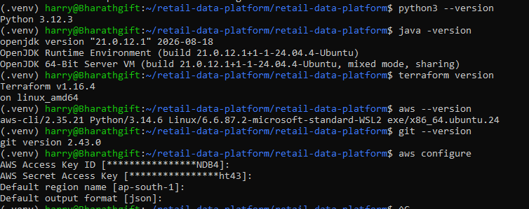
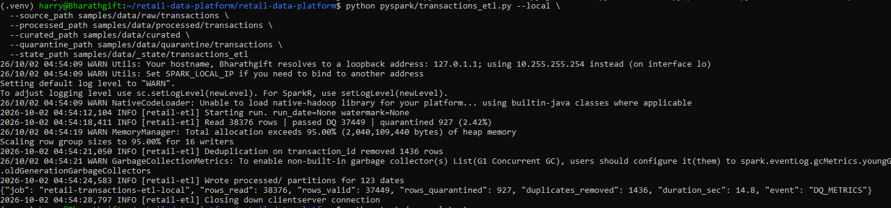
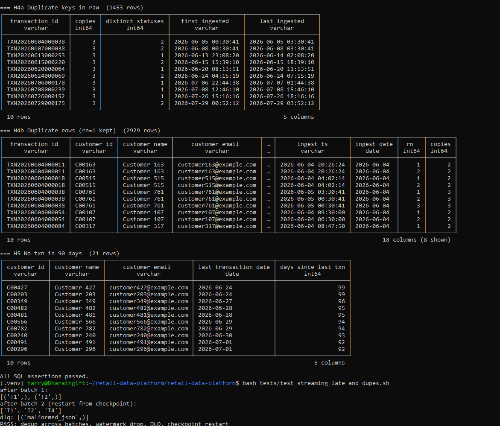
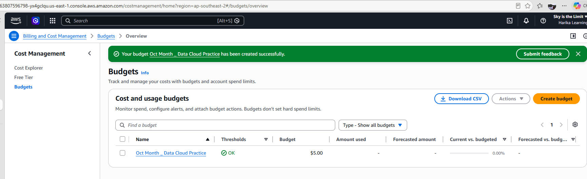

# ADIHR
Senior Cloud Data Engineer


## Pre-Requisites

> 


## UBUNTU

> 

> 

> 

```

(.venv) harry@Bharathgift:~/retail-data-platform/retail-data-platform$ python pyspark/transactions_etl.py --local \                                                                                                                            --source_path samples/data/raw/transactions \                                                                                                                                                                                                --processed_path samples/data/processed/transactions \                                                                                                                                                                                       --curated_path samples/data/curated \                                                                                                                                                                                                        --quarantine_path samples/data/quarantine/transactions \                                                                                                                                                                                     --state_path samples/data/_state/transactions_etl                                                                                                                                                                                          26/10/02 04:54:09 WARN Utils: Your hostname, Bharathgift resolves to a loopback address: 127.0.1.1; using 10.255.255.254 instead (on interface lo)                                                                                           26/10/02 04:54:09 WARN Utils: Set SPARK_LOCAL_IP if you need to bind to another address                                                                                                                                                      Setting default log level to "WARN".                                                                                                                                                                                                         To adjust logging level use sc.setLogLevel(newLevel). For SparkR, use setLogLevel(newLevel).                                                                                                                                                 26/10/02 04:54:09 WARN NativeCodeLoader: Unable to load native-hadoop library for your platform... using builtin-java classes where applicable                                                                                               2026-10-02 04:54:12,104 INFO [retail-etl] Starting run. run_date=None watermark=None                                                                                                                                                         2026-10-02 04:54:18,411 INFO [retail-etl] Read 38376 rows | passed DQ 37449 | quarantined 927 (2.42%)                                                                                                                                        26/10/02 04:54:19 WARN MemoryManager: Total allocation exceeds 95.00% (2,040,109,440 bytes) of heap memory                                                                                                                                   Scaling row group sizes to 95.00% for 16 writers                                                                                                                                                                                             2026-10-02 04:54:21,050 INFO [retail-etl] Deduplication on transaction_id removed 1436 rows                                                                                                                                                  26/10/02 04:54:21 WARN GarbageCollectionMetrics: To enable non-built-in garbage collector(s) List(G1 Concurrent GC), users should configure it(them) to spark.eventLog.gcMetrics.youngGenerationGarbageCollectors or spark.eventLog.gcMetrics.oldGenerationGarbageCollectors                                                                                                                                                                                                              2026-10-02 04:54:24,583 INFO [retail-etl] Wrote processed/ partitions for 123 dates                                                                                                                                                          {"job": "retail-transactions-etl-local", "rows_read": 38376, "rows_valid": 37449, "rows_quarantined": 927, "duplicates_removed": 1436, "duration_sec": 14.8, "event": "DQ_METRICS"}                                                          2026-10-02 04:54:28,797 INFO [retail-etl] Closing down clientserver connection                                                                                                                                                               (.venv) harry@Bharathgift:~/retail-data-platform/retail-data-platform$ python tests/run_sql_tests.py                                                                                                                                         dim_date                 1095 rows                                                                                                                                                                                                           dim_region                  5 rows                                                                                                                                                                                                           dim_customer              800 rows                                                                                                                                                                                                           fact_transactions       36013 rows                                                                                                                                                                                                           PK/FK integrity checks passed                                                                                                                                                                                                                                                                                                                                                                                                                                                             === H1 Top 10 customers  (10 rows)                                                                                                                                                                                                           ┌─────────────┬───────────────┬───────────┬───────────────┬────────────┐                                                                                                                                                                     │ customer_id │ customer_name │ txn_count │ total_amount  │ sales_rank │                                                                                                                                                                     │   varchar   │    varchar    │   int64   │ decimal(38,2) │   int64    │                                                                                                                                                                     ├─────────────┼───────────────┼───────────┼───────────────┼────────────┤                                                                                                                                                                     │ C00776      │ Customer 776  │        36 │     397893.88 │          1 │                                                                                                                                                                     │ C00393      │ Customer 393  │        46 │     397299.21 │          2 │                                                                                                                                                                     │ C00185      │ Customer 185  │        44 │     390947.26 │          3 │                                                                                                                                                                     │ C00378      │ Customer 378  │        38 │     385327.56 │          4 │                                                                                                                                                                     │ C00420      │ Customer 420  │        41 │     385055.48 │          5 │                                                                                                                                                                     │ C00598      │ Customer 598  │        42 │     382856.30 │          6 │                                                                                                                                                                     │ C00637      │ Customer 637  │        41 │     382279.17 │          7 │                                                                                                                                                                     │ C00269      │ Customer 269  │        53 │     379453.49 │          8 │                                                                                                                                                                     │ C00270      │ Customer 270  │        39 │     377647.14 │          9 │                                                                                                                                                                     │ C00523      │ Customer 523  │        38 │     375286.82 │         10 │                                                                                                                                                                     └─────────────┴───────────────┴───────────┴───────────────┴────────────┘                                                                                                                                                                       10 rows                                                    5 columns                                                                                                                                                                                                                                                                                                                                                                                                                    === H2 Region sales, last 30 days  (5 rows)                                                                                                                                                                                                  ┌─────────────┬───────────┬───────────────┬──────────────┐                                                                                                                                                                                   │ region_name │ txn_count │  total_sales  │ pct_of_total │                                                                                                                                                                                   │   varchar   │   int64   │ decimal(38,2) │    double    │                                                                                                                                                                                   ├─────────────┼───────────┼───────────────┼──────────────┤                                                                                                                                                                                   │ East        │      1148 │    8769354.67 │        20.63 │                                                                                                                                                                                   │ North       │      1136 │    8654600.51 │        20.36 │                                                                                                                                                                                   │ West        │      1108 │    8455954.72 │        19.89 │                                                                                                                                                                                   │ Central     │      1087 │    8365753.36 │        19.68 │                                                                                                                                                                                   │ South       │      1097 │    8262699.49 │        19.44 │                                                                                                                                                                                   └─────────────┴───────────┴───────────────┴──────────────┘                                                                                                                                                                                                                                                                                                                                                                                                                                === H3 Month-over-month growth  (5 rows)                                                                                                                                                                                                     ┌─────────────┬──────────────┬───────────────┬──────────────────┬────────────────┐                                                                                                                                                           │ year_number │ month_number │ monthly_sales │ prev_month_sales │ mom_growth_pct │                                                                                                                                                           │    int16    │    int16     │ decimal(38,2) │  decimal(38,2)   │     double     │                                                                                                                                                           ├─────────────┼──────────────┼───────────────┼──────────────────┼────────────────┤                                                                                                                                                           │        2026 │            6 │   36378596.62 │             NULL │           NULL │                                                                                                                                                           │        2026 │            7 │   41191930.02 │      36378596.62 │          13.23 │                                                                                                                                                           │        2026 │            8 │   41106610.11 │      41191930.02 │          -0.21 │                                                                                                                                                           │        2026 │            9 │   41236158.64 │      41106610.11 │           0.32 │                                                                                                                                                           │        2026 │           10 │    5265612.31 │      41236158.64 │         -87.23 │                                                                                                                                                           └─────────────┴──────────────┴───────────────┴──────────────────┴────────────────┘                                                                                                                                                                                                                                                                                                                                                                                                        === H4a Duplicate keys in raw  (1453 rows)                                                                                                                                                                                                   ┌───────────────────┬────────┬───────────────────┬─────────────────────┬─────────────────────┐                                                                                                                                               │  transaction_id   │ copies │ distinct_statuses │   first_ingested    │    last_ingested    │                                                                                                                                               │      varchar      │ int64  │       int64       │       varchar       │       varchar       │                                                                                                                                               ├───────────────────┼────────┼───────────────────┼─────────────────────┼─────────────────────┤                                                                                                                                               │ TXN20260604000038 │      3 │                 2 │ 2026-06-05 00:30:41 │ 2026-06-05 03:30:41 │                                                                                                                                               │ TXN20260607000038 │      3 │                 2 │ 2026-06-08 00:30:41 │ 2026-06-08 03:30:41 │                                                                                                                                               │ TXN20260613000253 │      3 │                 1 │ 2026-06-13 23:08:20 │ 2026-06-14 02:08:20 │                                                                                                                                               │ TXN20260615000220 │      3 │                 2 │ 2026-06-15 15:39:10 │ 2026-06-15 18:39:10 │                                                                                                                                               │ TXN20260620000064 │      3 │                 1 │ 2026-06-20 08:13:51 │ 2026-06-20 11:13:51 │                                                                                                                                               │ TXN20260624000069 │      3 │                 2 │ 2026-06-24 04:15:19 │ 2026-06-24 07:15:19 │                                                                                                                                               │ TXN20260706000178 │      3 │                 1 │ 2026-07-06 22:44:38 │ 2026-07-07 01:44:38 │                                                                                                                                               │ TXN20260708000239 │      3 │                 1 │ 2026-07-08 12:46:10 │ 2026-07-08 15:46:10 │                                                                                                                                               │ TXN20260726000152 │      3 │                 1 │ 2026-07-26 15:16:16 │ 2026-07-26 18:16:16 │                                                                                                                                               │ TXN20260729000175 │      3 │                 2 │ 2026-07-29 00:52:12 │ 2026-07-29 03:52:12 │                                                                                                                                               └───────────────────┴────────┴───────────────────┴─────────────────────┴─────────────────────┘                                                                                                                                                 10 rows                                                                          5 columns                                                                                                                                                                                                                                                                                                                                                                                              === H4b Duplicate rows (rn=1 kept)  (2929 rows)                                                                                                                                                                                              ┌───────────────────┬─────────────┬───────────────┬─────────────────────────┬───┬─────────────────────┬─────────────┬───────┬────────┐                                                                                                       │  transaction_id   │ customer_id │ customer_name │     customer_email      │ … │      ingest_ts      │ ingest_date │  rn   │ copies │                                                                                                       │      varchar      │   varchar   │    varchar    │         varchar         │ … │       varchar       │    date     │ int64 │ int64  │                                                                                                       ├───────────────────┼─────────────┼───────────────┼─────────────────────────┼───┼─────────────────────┼─────────────┼───────┼────────┤                                                                                                       │ TXN20260604000011 │ C00163      │ Customer 163  │ customer163@example.com │ … │ 2026-06-04 20:26:24 │ 2026-06-04  │     1 │      2 │                                                                                                       │ TXN20260604000011 │ C00163      │ Customer 163  │ customer163@example.com │ … │ 2026-06-04 20:26:24 │ 2026-06-04  │     2 │      2 │                                                                                                       │ TXN20260604000018 │ C00515      │ Customer 515  │ customer515@example.com │ … │ 2026-06-04 04:02:14 │ 2026-06-04  │     1 │      2 │                                                                                                       │ TXN20260604000018 │ C00515      │ Customer 515  │ customer515@example.com │ … │ 2026-06-04 04:02:14 │ 2026-06-04  │     2 │      2 │                                                                                                       │ TXN20260604000038 │ C00761      │ Customer 761  │ customer761@example.com │ … │ 2026-06-05 03:30:41 │ 2026-06-04  │     1 │      3 │                                                                                                       │ TXN20260604000038 │ C00761      │ Customer 761  │ customer761@example.com │ … │ 2026-06-05 00:30:41 │ 2026-06-04  │     2 │      3 │                                                                                                       │ TXN20260604000038 │ C00761      │ Customer 761  │ customer761@example.com │ … │ 2026-06-05 00:30:41 │ 2026-06-04  │     3 │      3 │                                                                                                       │ TXN20260604000054 │ C00107      │ Customer 107  │ customer107@example.com │ … │ 2026-06-04 09:30:00 │ 2026-06-04  │     1 │      2 │                                                                                                       │ TXN20260604000054 │ C00107      │ Customer 107  │ customer107@example.com │ … │ 2026-06-04 06:30:00 │ 2026-06-04  │     2 │      2 │                                                                                                       │ TXN20260604000084 │ C00317      │ Customer 317  │ customer317@example.com │ … │ 2026-06-04 08:47:50 │ 2026-06-04  │     1 │      2 │                                                                                                       └───────────────────┴─────────────┴───────────────┴─────────────────────────┴───┴─────────────────────┴─────────────┴───────┴────────┘                                                                                                         10 rows                                                                                                       18 columns (8 shown)                                                                                                                                                                                                                                                                                                                                                      === H5 No txn in 90 days  (21 rows)                                                                                                                                                                                                          ┌─────────────┬───────────────┬─────────────────────────┬───────────────────────┬─────────────────────┐                                                                                                                                      │ customer_id │ customer_name │     customer_email      │ last_transaction_date │ days_since_last_txn │                                                                                                                                      │   varchar   │    varchar    │         varchar         │         date          │        int64        │                                                                                                                                      ├─────────────┼───────────────┼─────────────────────────┼───────────────────────┼─────────────────────┤                                                                                                                                      │ C00427      │ Customer 427  │ customer427@example.com │ 2026-06-24            │                  99 │                                                                                                                                      │ C00203      │ Customer 203  │ customer203@example.com │ 2026-06-24            │                  99 │                                                                                                                                      │ C00349      │ Customer 349  │ customer349@example.com │ 2026-06-27            │                  96 │                                                                                                                                      │ C00482      │ Customer 482  │ customer482@example.com │ 2026-06-28            │                  95 │                                                                                                                                      │ C00481      │ Customer 481  │ customer481@example.com │ 2026-06-28            │                  95 │                                                                                                                                      │ C00566      │ Customer 566  │ customer566@example.com │ 2026-06-29            │                  94 │                                                                                                                                      │ C00782      │ Customer 782  │ customer782@example.com │ 2026-06-29            │                  94 │                                                                                                                                      │ C00240      │ Customer 240  │ customer240@example.com │ 2026-06-30            │                  93 │                                                                                                                                      │ C00491      │ Customer 491  │ customer491@example.com │ 2026-07-01            │                  92 │                                                                                                                                      │ C00296      │ Customer 296  │ customer296@example.com │ 2026-07-01            │                  92 │                                                                                                                                      └─────────────┴───────────────┴─────────────────────────┴───────────────────────┴─────────────────────┘                                                                                                                                        10 rows                                                                                   5 columns                                                                                                                                                                                                                                                                                                                                                                                     All SQL assertions passed.                                                                                                                                                                                                                   (.venv) harry@Bharathgift:~/retail-data-platform/retail-data-platform$ bash tests/test_streaming_late_and_dupes.sh                                                                                                                           after batch 1:                                                                                                                                                                                                                               [('T1',), ('T2',)]                                                                                                                                                                                                                           after batch 2 (restart from checkpoint):                                                                                                                                                                                                     ['T1', 'T2', 'T4']                                                                                                                                                                                                                           dlq: [('malformed_json',)]                                                                                                                                                                                                                   PASS: dedup across batches, watermark drop, DLQ, checkpoint restart 


```


## AWS Cost Budget


